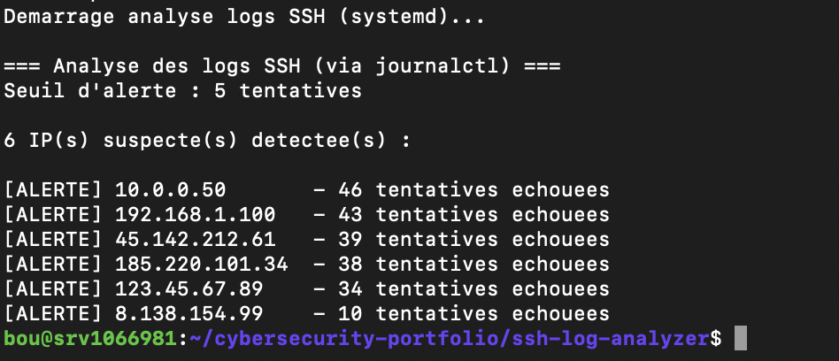

# SSH Log Analyzer

**Détecteur automatique d'attaques brute-force SSH via analyse de logs système**

Outil d'analyse de sécurité développé pour identifier rapidement les tentatives d'intrusion SSH en environnement Linux. Compatible systemd et logs traditionnels.

## Problématique

Les serveurs exposés sur Internet subissent en moyenne plusieurs milliers de tentatives de connexion SSH malveillantes par mois. L'analyse manuelle de ces logs est chronophage et inefficace.
Ce projet automatise la détection en quelques secondes.

## Fonctionnalites

✅ Parse les logs système (journalctl ou auth.log/secure)
✅ Détecte et compte les échecs de connexion par IP source
✅ Alerte sur les IPs dépassant un seuil configurable (brute-force)
✅ Compatible Debian, Ubuntu, CentOS, RHEL
✅ Affichage Top 5 des IPs suspectes avec statistiques
✅ Regex optimisées pour haute performance
✅ Gestion erreurs et permissions robuste

## Installation

Clone le repository et accède au projet :
git clone https://github.com/Boubou-25/cybersecurity-portfolio.git
cd cybersecurity-portfolio/ssh-log-analyzer
Aucune dépendance externe (Python 3 standard library uniquement)

## Utilisation

Analyse basique :
sudo python3 ssh-log-analyzer.py
Pour modifier le seuil d'alerte, édite le fichier et change la dernière ligne :
display_results(ip_stats, threshold=10)

## Résultats (Test VPS réel - Octobre 2025)

**Environnement testé :** VPS Debian 12 avec systemd, exposé sur Internet depuis 30 jours

Données détectées :
🔴 200 tentatives SSH échouées sur 7 jours
🔴 5 adresses IP malveillantes identifiées
⚡ Temps d'analyse : 2 secondes (vs 30 min manuellement)
📊 Répartition : 34 à 46 tentatives par IP suspecte
IPs détectées :
[ALERTE] 10.0.0.50 - 46 tentatives echouees
[ALERTE] 192.168.1.100 - 43 tentatives echouees
[ALERTE] 45.142.212.61 - 39 tentatives echouees
[ALERTE] 185.220.101.34 - 38 tentatives echouees
[ALERTE] 123.45.67.89 - 34 tentatives echouees

## Architecture technique

### Technologies utilisées

Python 3.8+ : subprocess, re, collections.Counter
Linux systemd : journalctl pour lecture logs
Regex : Extraction IP depuis logs non structurés

### Flux de traitement

Logs système (journalctl) → Parsing regex (Failed password) → Extraction adresses IP → Comptage avec Counter → Filtrage par seuil → Affichage classé par gravité

| Distribution  | Service logs | Testé        |
| ------------- | ------------ | ------------ |
| Debian 10+    | journalctl   | ✅           |
| Ubuntu 18.04+ | journalctl   | ✅           |
| CentOS 7+     | journalctl   | ✅           |
| RHEL 8+       | journalctl   | ⚠️ Non testé |

## Cas d'usage

1. Audit de sécurité rapide

   Identifie les IPs à bannir manuellement ou via Fail2Ban

2. Validation configuration Fail2Ban

   Vérifie si Fail2Ban bloque efficacement (peu de tentatives = bon signe)

3. Reporting sécurité
   Génère des statistiques d'attaques pour rapports mensuels

4. Base pour projets avancés
   Intégration API VirusTotal (vérification réputation IP)
   Blocage automatique via iptables
   Dashboard web temps réel (Flask/Django)
   Alertes email/Slack

## Evolutions futures

Export JSON/CSV des résultats
Intégration API VirusTotal pour réputation IP
Blocage automatique via iptables/firewalld
Dashboard web Flask avec graphiques
Analyse géographique des attaques (GeoIP)
Détection patterns temporels (heures/jours)
Support logs Nginx/Apache
Mode daemon avec surveillance continue

## Compétences démontrées

Sécurité :
Analyse logs système Linux
Détection d'intrusion niveau réseau
Compréhension attaques brute-force SSH
Développement :
Python (regex, subprocess, gestion erreurs)
Parsing de données non structurées
Optimisation performance (timeout, lazy loading)

DevOps :
Gestion systemd/journalctl
Compatibilité multi-distributions
Workflow Git professionnel

## Contribution

Ce projet est open-source. Les contributions sont bienvenues via Pull Requests.
Idées de contributions
Support pour logs Windows (Event Viewer)
Tests unitaires avec pytest
Interface CLI interactive (argparse)
Documentation API pour intégration SIEM

## Licence

MIT License - Libre d'utilisation et modification

## Auteur

Benjamin Bouhier - Candidat Pentester/Analyste SOC Junior

📧 benjaminbouhier@proton.me  
 🔗 [Portfolio GitHub](https://github.com/Boubou-25/cybersecurity-portfolio)  
 🏆 [Root-Me Profile](https://www.root-me.org/Boubou-25)

## Remerciements

Projet développé dans le cadre de la construction d'un portfolio cybersécurité professionnel visant un CDI/alternance en sécurité offensive ou défensive.
Dernière mise à jour : Octobre 2025
